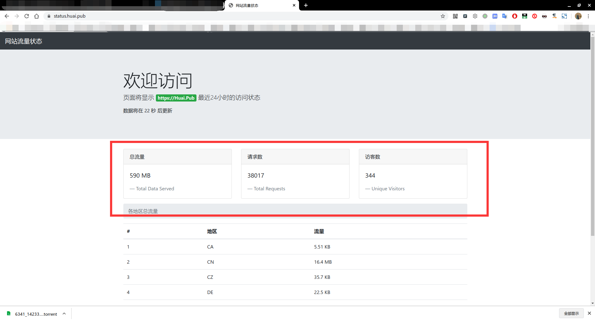
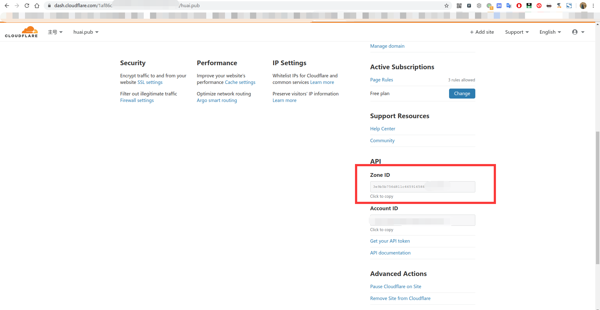
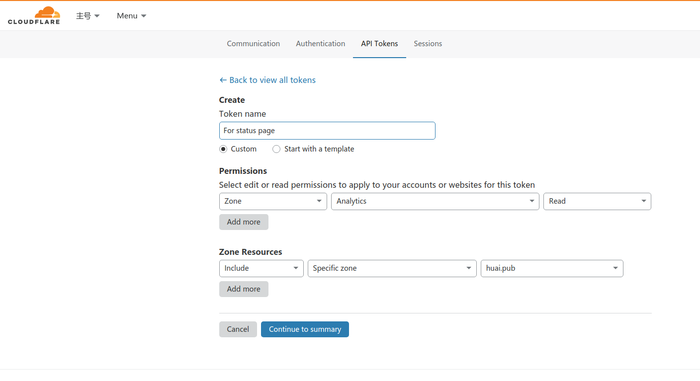
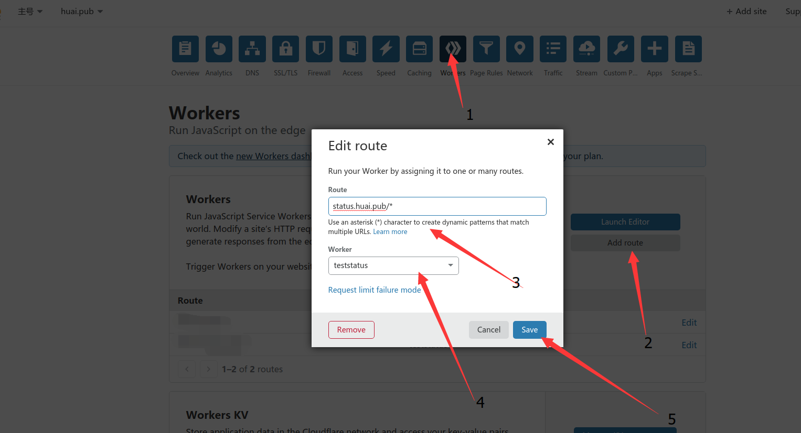

脚本实现的功能：实时查看站点流量状态



原理:

利用CloudFlare提供的Worker功能，实时从API（也是CF提供）提取对应域名的analytics信息，并返回可视化数据。

使用:

1. 打开status.js 配置相关信息

   ``` Javascript 
   //配置你要监控的域名
   const zone = "";
   //组合域名到API接口访问地址
   const url = "https://api.cloudflare.com/client/v4/zones/" + zone + "/analytics/dashboard?since=-1440&continuous=true";
   //你的API验证token
   const token = ""
   //页面显示的地址
   const echourl="https://Huai.Pub";
   ```

+ zone 

  就是ZoneID，打开某域名页面，然后下滑看右下角。

  

+ token

  去API页面（点击右上角头像选择my profile，再选择api tokens，最后点击create token）新建一个token

  

  我们仅需要给指定zone的analytics的Read权限，就足够了。

  然后点击Continue,会返回创建的token，是一串含有字符的不规则字符串。

+ 页面显示地址

  这个就是对应显示的`页面将显示xxxx最近24小时的访问状态`  

2. 部署到workers

新建一个worker，把上面的配置好信息后的脚本填进去。

然后到某域名设置一个路由去访问（别忘了解析改域名并开启CDN）



然后就可以访问他了。